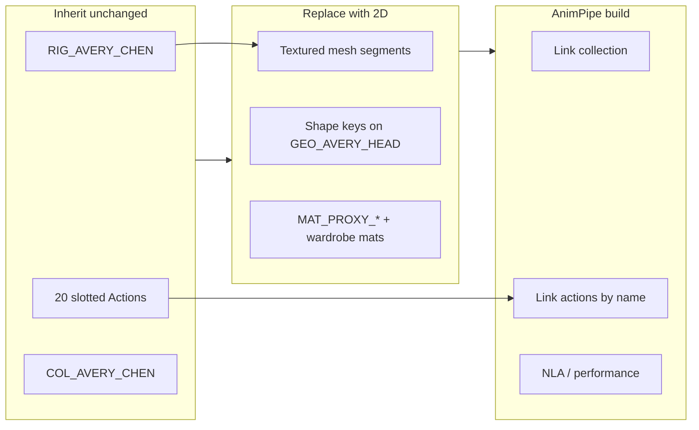

---
cursor:
  subagentId: "bc-dbf6ea97-fcd0-5252-8f66-a596aa90ef9c"
---

# Patty 2D cutout — implementation plan (Blender 5.2.1)

Replace the visible Avery Chen V3 **3D** hero meshes with a **flat illustrated cutout** that still links and plays through AnimPipe exactly like `char.avery_chen` today: same collection, armature object, bone names/hierarchy, slotted action names, and facial shape-key vocabulary. No runtime retarget, bake, or rig rebuild in the pipeline.

**Inputs (read-only for this plan):** `internal/character-contract.md`, `docs/avery-chen/README.md`, `docs/avery-chen/build.json`, `docs/avery-chen/build_avery_chen.py`, `internal/v3-facial-rig-plan.md`, `internal/v3-style-translation.md`, reference `docs/avery-chen/docs/reference/patty-patties-style.jpg`.

**Out of scope for this document:** editing `AveryChen.blend`, git, or manifest YAML. The deliverable is a build recipe a follow-up builder can implement.

---

## 1. Non-negotiable link-and-play contract

These must match the proxy admission doctor and the V3 builder validator (`blend_build/asset_doctor_blender.py` + `build_avery_chen.py` `validate_scene()`).

| Contract field | Locked value |
|---|---|
| Asset id (downstream) | `char.avery_chen` |
| Collection | `COL_AVERY_CHEN` |
| Armature object | `RIG_AVERY_CHEN` |
| Retarget profile | `proxy_rig_v1` (18 bones, exact names/parents in `BONE_PARENTS` in `build_avery_chen.py`) |
| Pose bone rotation | `XYZ` |
| Coordinates | meters, Z up, forward **−Y**, scale 1.0 |
| Interaction | `hand_left` → `hand.L`, `hand_right` → `hand.R` |
| Materials (manifest roles) | `MAT_PROXY_CHARACTER`, `MAT_PROXY_FOCUS` |
| Actions | 20 canonical slotted names (`idle_neutral_loop` … `pose_end`); **do not rename or reauthor curves** |
| Visemes (9) | `VISEME_A` … `VISEME_H`, `VISEME_X` |
| Expressions (8) | `BLINK`, `BROW_UP`, `BROW_DOWN`, `EXP_smile`, `EXP_frown`, `EXP_surprise`, `LOOK_LEFT`, `LOOK_RIGHT` |
| Shape-key host | **Real mesh** shape keys (doctor unions all mesh key names). Grease Pencil–only assets **fail** if keys are not on meshes. |
| Libraries | None linked at save time |
| Images | Packed (`packed_file` set); no machine-local `//` paths |

**Doctor vs. V3 builder:** Pipeline `asset doctor --blender` does not enforce triangle counts. The current V3 script rejects &lt;45k or &gt;120k tris — a 2D builder should use a **separate** validator (or relaxed thresholds), not the 3D coherent-base floor.

---

## 2. Key technical decisions

1. **Representation:** Single-sided **mesh planes** (and minimal thickness only where z-fighting demands it), textured with illustrated PNGs, **not** Grease Pencil strokes as the rigged medium.
2. **Facing:** Cutout normals point **+Y** so the illustrated front faces scene **−Y** (camera/forward convention). Meshes stay in metric space; layout is authored in the XZ plane per limb/segment.
3. **Motion:** Keep **`RIG_AVERY_CHEN` datablocks and all 20 actions** from an existing coherent file; replace only mesh objects and materials. Body motion is **bone-driven** via armature modifier + vertex groups (same 18 groups as bone names). Do **not** bone-parent only (proxy kit generator pattern) — weighted cutouts need to bend at joints when forearm/shin bones rotate.
4. **Action source order:**  
   1. `docs/avery-chen/AveryChen.blend` (store copy; `build.json` lists all 20 actions and slotted validation).  
   2. Fallback: `docs/avery-chen/vendor/avery-chen/coherent-base.blend` (checksum `22fb0364…` per README).  
   Copy actions with `use_fake_user = True`; verify each action has **slots** on Blender 5.2.1. If an action exists only in one file, prefer the file that passes slotted checks — never invent alternate names or durations in the manifest.
5. **Facial contract:** **`GEO_AVERY_HEAD`** owns `Basis` + all 9 visemes + all 8 expressions (same spelling as V3). **`GEO_AVERY_EYES`** keeps `LOOK_LEFT` / `LOOK_RIGHT` with **drivers** from head keys. **`GEO_AVERY_BROWS`** keeps `BROW_UP`, `BROW_DOWN`, and `EXP_surprise` driven from head (mirror V3 `build_avery_chen.py` driver pattern). Satellite keys are allowed; required names must exist on the specified owners.
6. **Teeth at neutral:** **`GEO_AVERY_TEETH`** (and tongue if retained) **hidden from render** at rest (`hide_render`, and optionally `hide_viewport` for tooling). Reuse V3-style **internal** teeth keys + drivers (`JAW_OPEN`, `SMILE_REVEAL`, viseme clamps) so open-mouth visemes and `EXP_smile` / `EXP_surprise` can reveal a **flat** tooth band texture only when driven — never visible at neutral with all keys at 0.
7. **Textures:** All albedo/mask sheets **packed** in the `.blend`; materials reference images by datablock name only. Wardrobe palette locks remain from `v3-style-translation.md` / forthcoming 2D style spec — do not eyedrop the 480×360 reference JPEG.
8. **Style id / version:** Recommend `style_id: avery_chen_patty_2d` and semver bump (e.g. `4.0.0`) in scene custom props and `build.json`, while keeping **`retarget_profile: proxy_rig_v1`** and manifest asset id unchanged so shots do not retarget.

---

## 3. Architecture overview



At runtime the shot file **links** `COL_AVERY_CHEN`, overrides if needed, and **links Actions by name** from the same `.blend`. Shape keys are driven by the performance layer (Rhubarb viseme letters → `VISEME_*`, expression tracks → `EXP_*` / `BLINK` / brows / look). Zero change to `blend_build/assets.py` contract.

---

## 4. Work phases

### Phase A — Shell extraction (no new art)

1. Open **action source** (`AveryChen.blend` preferred) in Blender **5.2.1 LTS**.
2. Duplicate file to a working cutout scene; delete **mesh** objects in `COL_AVERY_CHEN` only — keep `RIG_AVERY_CHEN`, all `bpy.data.actions`, `MAT_PROXY_CHARACTER`, `MAT_PROXY_FOCUS`, and text blocks if desired.
3. Confirm: 18-bone set equals `BONE_PARENTS`; every action in `ACTIONS` list in `build_avery_chen.py` exists and is slotted; armature rest pose matches proxy acceptance poses (neutral feet on ground, −Y forward).
4. Export a **rig snapshot** JSON (bone head/tail/rest matrices) for aligning planes in Phase B.

### Phase B — Illustrated segment mesh kit

Author or import **flat** parts (SVG/PSD → PNG → planes). Suggested object set (names preserve V3 manifest familiarity and facial owners):

| Segment object | Primary weights | Notes |
|---|---|---|
| `GEO_AVERY_HEAD` | `head` (majority) + minor `neck` | Face plane; **all** viseme/expression shape keys |
| `GEO_AVERY_EYES` | `head` | Textured sclera/iris; look keys or drivers |
| `GEO_AVERY_BROWS` | `head` | Separate plane in front of eyes; brow/surprise drivers |
| `GEO_AVERY_HAIR` | `head` | Single or few hair planes; head-locked (no extra bones) |
| `GEO_AVERY_BODY` | `chest`, `spine`, `pelvis` | Torso illustration |
| `GEO_AVERY_SHIRT` | `chest`, `spine` | Optional split for parallax |
| Jacket / sleeves / trousers / shoes / socks / accessories | Matching limb bones (`upper_arm.L`, `forearm.L`, …) | Split at logical joints for bending |
| `GEO_AVERY_GLASSES` / `GEO_AVERY_LENSES` | `head` | Lenses use transparent/clear shader; frame uses character mat |
| `GEO_AVERY_TEETH` | `head` | **Hidden** at neutral; simple quad band |

**Construction rules:**

- Each segment: grid mesh in **XZ**, centered on the bone chain it follows; pivot at joint where rotation should originate.
- **Armature modifier** on every visible mesh; vertex groups named exactly like bones; normalize weights; use 2–4 influences max per vert for clean bending.
- Slight **overlap** at joints (2–5 mm) to avoid gaps during `walk_cycle` / `wave` — validate against action frames listed in `build.json` `tested_action_frames`.
- Keep triangle budget modest (target **&lt;15k** total for 2D); doctor does not care, but link performance and file size should improve vs. 66k V3 tris.

**Orientation check:** From front (−Y camera), character reads upright; +X is character right; feet on Z=0 ground plane consistent with V3 scene.

### Phase C — Shape keys and drivers

1. On **`GEO_AVERY_HEAD`**, add `Basis` then the 17 required keys (9 visemes + 8 expressions). Values at rest: all **0**.
2. **Authoring strategy (pick one, in order of preference):**
   - **2D-native:** Paint each key as an illustrated mouth/face state from the Patty 2D style spec (companion agent), UV-aligned on the head plane.
   - **Transfer assist:** Shrinkwrap a temporary hidden V3 head, sample basis deltas, simplify to plane topology, then hand-fix silhouettes for 2D readability.
3. Enforce validator rules from V3: each non-Basis key must move geometry (&gt;0.05 mm max displacement); no nonzero default values.
4. Rebuild **drivers** on eyes, brows, teeth matching `build_avery_chen.py` (`drive_shape_key`, jaw clamp on combined openers).
5. **`GEO_AVERY_EYES`:** duplicate `LOOK_LEFT` / `LOOK_RIGHT` driven 1:1 from head (or UV offset shape keys for iris slide on a flat texture).

### Phase D — Materials and packing

1. **`MAT_PROXY_CHARACTER`:** Image Texture → Principled BSDF (alpha clip or hashed blend for cutout edges). Assign to skin/cloth regions per segment material slots.
2. **`MAT_PROXY_FOCUS`:** Flat highlight color for focus rings / UI emphasis (same role as proxy kit).
3. Wardrobe-specific materials may remain named (`MAT_AVERY_*`) for art clarity; manifest shot overrides still resolve `MAT_PROXY_*` by role.
4. `bpy.ops.file.pack_all()` before save; reopen and assert no external images (`validate_scene` pattern).

### Phase E — New builder script

Add **`scripts/build_avery_chen_2d.py`** (or extend builder with `--mode patty_2d`) that:

1. Starts from action source blend (Phase A).
2. Installs segment meshes from embedded library blend or procedural plane factory + texture paths under `docs/avery-chen/` (relative to repo root only).
3. Applies drivers, neutralizes scene, saves `assets/characters/AveryChen.blend` (or staged path).
4. Writes `build.json` with updated `style_id`, triangle counts, sha256, **same** action list and facial name arrays.
5. Runs reopen verification mirroring V3 checks **except** triangle floor/ceiling appropriate to 2D.
6. Optional: render a reduced evidence set (front, expression sheet, viseme strip, walk frame) for QA.

**Do not** call MakeHuman/MPFB at runtime; optional vendored PNGs only.

### Phase F — Pipeline admission

When integrated into AnimPipe repo:

```bash
.venv/bin/pipe asset doctor char.avery_chen
.venv/bin/pipe asset doctor char.avery_chen --blender
```

Confirm collection, armature, 20 actions, visemes on meshes, expressions in union. Update `assets/assets.yaml` sha256 after export-manifest.

---

## 5. Action and rig copy procedure (detailed)

To avoid conflicting F-curves or missing slots:

1. With target scene containing only armature + actions, use **File → Append** (or Python `bpy.ops.wm.append`) from source blend:
   - `Action/` → each of the 20 names (if starting from empty actions).
   - Or: start from full `AveryChen.blend` and delete meshes — actions stay local.
2. For each appended action, set `use_fake_user = True`.
3. On Blender 5.2.1, verify `len(action.slots) > 0`; if empty, re-save action from armature in source file first — do not manually recreate curves under new names.
4. **Never** mix proxy kit action names (`idle_neutral_loop` is shared) with humanoid example vocabulary from `assets/assets.yaml.example`.

Rest pose: if source armature differs microscopically from proxy generator, **do not** edit bone rolls/names — fix mesh binding to source rest pose instead.

---

## 6. Validation checklist (pre-ship)

- [ ] `COL_AVERY_CHEN` contains armature + all cutout meshes; nothing essential outside collection.
- [ ] `RIG_AVERY_CHEN` bone set/parents/rotation modes match contract.
- [ ] All 20 actions present, slotted, fake-user; loop actions (`idle_neutral_loop`, `walk_cycle`) match frame 1 ≈ last frame on pose bones (&lt;1e-4).
- [ ] All viseme names on **`GEO_AVERY_HEAD`** shape keys; all expression names in union across meshes; head holds full set.
- [ ] Drivers: eyes/brows/teeth respond; teeth **not** visible in neutral render.
- [ ] Sample frames from `build.json` `tested_action_frames`: finite bounds, no exploded weights on `gesture_present`, `reach_grab`, `walk_cycle`.
- [ ] `MAT_PROXY_CHARACTER` and `MAT_PROXY_FOCUS` exist.
- [ ] No linked libraries; all images packed.
- [ ] `pipe asset doctor char.avery_chen --blender` PASS (when pipeline available).

---

## 7. Risks and mitigations

| Risk | Mitigation |
|---|---|
| Grease Pencil workflow omits mesh shape keys | Mandate mesh planes; GP only as optional concept art import |
| Flat face visemes unreadable at 3/4 | Author keys on head plane with slight cheek/jaw mesh bend; test `facial-angle-matrix` views |
| Joint gaps on weighted planes | Overlap geometry; test worst-case frames from all 12 motion actions |
| Action slot loss on append | Always seed from `AveryChen.blend`; run slot check before mesh work |
| Accidental action re-keying | Lock action datablocks read-only in builder; compare action name set + frame counts to source JSON |
| Triangle validator false fail | Separate 2D verify script thresholds |
| Style drift from 3D V3 | Lock to Patty 2D style spec + palette doc; version `style_id` separately from rig profile |

---

## 8. Dependencies on sibling work

- **2D style spec agent:** Final mouth/eye/brow neutral and keyed states for texture and shape-key targets.
- **2D character blend agent:** Implements this plan in Blender; does not change action vocabulary.
- **Repository integration:** LFS path `assets/characters/AveryChen.blend`, manifest sha256, unchanged `retarget_profile`.

---

## 9. Success criteria

A shot configured for `char.avery_chen` with `proxy_rig_v1` and canonical action names builds and plays with a **2D illustrated** cast on screen, passes **blender doctor**, and requires **no pipeline code changes** beyond optional asset version/sha256 and relaxed local triangle QA in the 2D builder.
